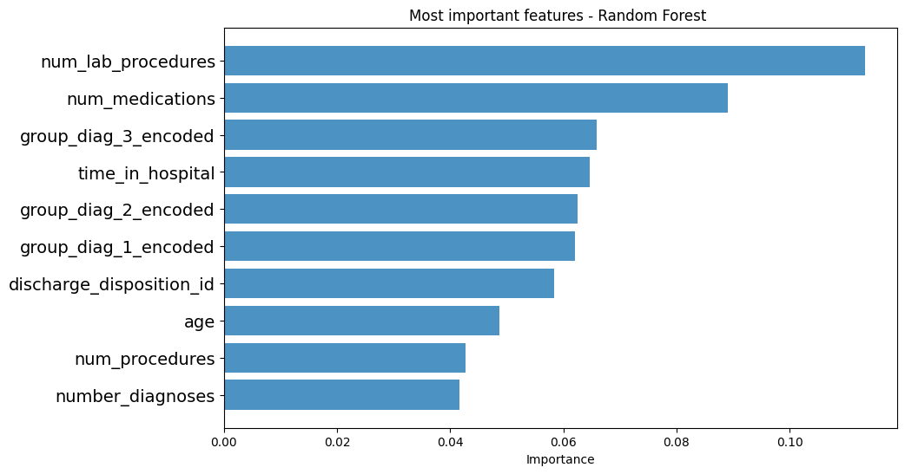

# Laporan Proyek Machine Learning - Farrel Jonathan Vickeldo

## Domain Proyek

Manajemen hiperglikemia pada pasien rawat inap memiliki dampak signifikan terhadap kualitas perawatan, yang tercermin dalam penurunan angka morbiditas dan mortalitas. Di lingkungan ICU, protokol pengelolaan glukosa yang ketat telah banyak diterapkan, tetapi hal yang sama tidak berlaku untuk pasien rawat inap non-ICU. Pengelolaan diabetes pada pasien non-ICU sering kali dilakukan secara tidak konsisten, bahkan tidak jarang diabaikan sama sekali. Beberapa penelitian menunjukkan bahwa penerapan protokol berbasis data, seperti pengukuran HbA1c, terbukti efektif dan aman dalam meningkatkan kualitas perawatan pasien rawat inap. Pengukuran HbA1c tidak hanya menjadi indikator penting perhatian terhadap perawatan diabetes, tetapi juga diduga mampu menurunkan angka hospital readmission pada pasien diabetes ([Beata Strack et al., "Impact of HbA1c Measurement on Hospital Readmission Rates: Analysis of 70,000 Clinical Database Patient Records"](https://doi.org/10.1155/2014/781670)).

Permasalahan ini penting untuk segera diatasi karena tingginya angka hospital readmission pasien diabetes berdampak buruk pada kualitas layanan kesehatan dan efisiensi biaya rumah sakit. Berdasarkan penelitian oleh Beata Strack dan koleganya, analisis data klinis terhadap lebih dari 70.000 pasien menunjukkan bahwa pengukuran HbA1c memiliki potensi signifikan dalam mengurangi angka readmission dengan memberikan wawasan lebih baik tentang kondisi diabetes pasien. Namun, hambatan utama terletak pada kurangnya evaluasi nasional terhadap pengelolaan diabetes di rumah sakit, yang mengakibatkan tidak adanya baseline yang kuat untuk memandu perubahan.

Selain itu, analisis data klinis yang heterogen dan kompleks menghadirkan tantangan dalam pemanfaatannya, seperti nilai yang hilang, inkonsistensi, dan kompleksitas tinggi dari fitur data. Namun, dengan memanfaatkan data klinis dalam skala besar, rumah sakit dapat menemukan informasi dan strategi baru untuk meningkatkan kualitas perawatan, mengurangi angka readmission, dan menekan biaya kesehatan.

## Business Understanding

### Problem Statement

1. Tingginya angka hospital readmission pada pasien diabetes mencerminkan permasalahan kualitas perawatan rawat inap, khususnya di luar ICU.
2. Implementasi protokol berbasis data, seperti pengukuran HbA1c, memiliki potensi untuk mengurangi angka readmission dan meningkatkan efisiensi biaya kesehatan.
3. Kurangnya evaluasi nasional mengenai perawatan diabetes di rumah sakit menjadi hambatan dalam menciptakan panduan dan baseline yang relevan untuk perubahan sistem perawatan.
4. Tantangan teknis dalam analisis data klinis yang kompleks dan heterogen perlu diatasi untuk menggali wawasan baru yang dapat meningkatkan keselamatan pasien dan efisiensi sistem kesehatan.

### Goals

1.   Faktor-faktor apa yang menjadi prediktor terkuat untuk rawat inap ulang pasien diabetes?
2.   Seberapa baik kita dapat memprediksi rawat inap ulang pasien diabetes dalam kumpulan data ini dengan fitur terbatas?
3.   Bagaimana kita dapat menentukan penggunaan model berdasarkan use case tertentu sesuai kebutuhan?

## Data Understanding

Data yang digunakan dapat diakses [disini](https://archive.ics.uci.edu/dataset/296/diabetes+130-us+hospitals+for+years+1999-2008)

Dataset tersebut merepresentasikan catatan pasien rawat inap yang didiagnosis menderita diabetes dalam sepuluh tahun (1999-2008) perawatan klinis di 130 rumah sakit AS dan jaringan pengiriman terintegrasi. Ini mencakup 50 fitur yang merepresentasikan hasil pasien dan rumah sakit. Informasi diekstraksi dari basis data untuk pertemuan yang memenuhi kriteria berikut.

1.   Ini adalah pertemuan rawat inap (masuk rumah sakit).
2.   Ini adalah pertemuan diabetes, yaitu, pertemuan di mana semua jenis diabetes dimasukkan ke dalam sistem sebagai diagnosis.
3.   Lama tinggal minimal 1 hari dan maksimal 14 hari.
4.   Pemeriksaan laboratorium dilakukan selama pertemuan.
5.   Pemberian obat-obatan dilakukan selama pertemuan

### Variabel-variabel dalam dataset

1. `encounter_id` id unik untuk setiap pertemuan
2. `patient_nbr` id unik untuk setiap pasien
3. `race` nilai: Caucasian, Asian, African American, Hispanic, and lainnya
4. `gender` nilai: male, female, dan unknown/invalid
5. `age` dikelompokkan dalam interval 10 tahun: [0, 10), [10, 20),..., [90, 100)
6. `weight` Weight dalam pon.
7. `admission_type_id` id integer yang sesuai dengan 9 nilai berbeda, misalnya, emergency, urgent, elective, newborn, dan not available.
8. `discharge_disposition_id` id identifier yang sesuai dengan 29 nilai yang berbeda, seperti discharged to home, expired, and not available.
9. `admission_source_id` id identifier yang sesuai dengan 21 nilai yang berbeda, seperti physician referral, emergency room, and transfer from a hospital.
10. `time_in_hospital` jumlah hari antara penerimaan dan pemulangan.
11. `payer_code` id integer yang sesuai dengan 23 nilai yang berbeda, seperti Blue Cross/Blue Shield, Medicare, and self-pay Medical
12. `medical_specialty` Integer identifier of a specialty of the admitting physician, corresponding to 84 distinct values, for example, cardiology, internal medicine, family/general practice, and surgeon.
13. `num_lab_procedures` jumlah tes laboratorium yang dilakukan selama pertemuan.
14. `num_procedures` jumlah prosedur (selain tes laboratorium) yang dilakukan selama pertemuan.
15. `num_medications` jumlah nama generik berbeda yang diberikan selama pertemuan.
16. `number_outpatient` jumlah kunjungan pasien rawat jalan pada tahun sebelum pertemuan.
17. `number_emergency` jumlah kunjungan gawat darurat pasien pada tahun sebelum pertemuan.
18. `number_inpatient` jumlah kunjungan pasien rawat inap pada tahun sebelum pertemuan.
19. `diag_1` diagnosis utama (dikodekan sebagai tiga digit pertama ICD9); 848 nilai berbeda.
20. `diag_2` diagnosis sekunder (dikodekan sebagai tiga digit pertama ICD9); 923 nilai berbeda.
21. `diag_3` diagnosis sekunder tambahan (dikodekan sebagai tiga digit pertama ICD9); 954 nilai berbeda.
22. `number_diagnoses` jumlah diagnosis yang dimasukkan ke dalam sistem.
23. `max_glu_serum` menunjukkan kisaran hasil atau jika tes tidak dilakukan. Nilai: >200, >300, normal, dan tidak ada jika tidak diukur.
24. `A1Cresult` menunjukkan rentang hasil atau jika tes tidak dilakukan. Nilai: >8 jika hasilnya lebih besar dari 8%, >7 jika hasilnya lebih besar dari 7% tetapi kurang dari 8%, normal jika hasilnya kurang dari 7%, dan tidak ada jika tidak diukur.
25. `change` Menunjukkan jika ada perubahan pada obat diabetes (baik dosis atau nama generik). Nilai: change dan no change.
26. `diabetesMed` menunjukkan apakah ada obat diabetes yang diresepkan. Nilai: yes dan no.
27. 24 fitur untuk obat-obatan Untuk nama generik: `metformin`, `repaglinide`, `nateglinide`, `chlorpropamide`, `glimepiride`, `acetohexamide`, `glipizide`, `glyburide`, `tolbutamide`, `pioglitazone`, `rosiglitazone`, `acarbose`, `miglitol`, `troglitazone`, `tolazamide`, `examide`, `sitagliptin`, `insulin`, `glyburide-metformin`, `glipizide-metformin`, `glimepiride- pioglitazone`, `metformin-rosiglitazone`, dan `metformin-pioglitazone`. Fitur ini menunjukkan apakah obat tersebut diresepkan atau ada perubahan dosis. Nilai: “naik” jika dosis ditingkatkan selama pertemuan, “turun” jika dosis dikurangi, “stabil” jika dosis tidak berubah, dan “tidak” jika obat tidak diresepkan.
28. `readmitted` jumlah hari hingga pasien rawat inap kembali. Nilai: <30 jika pasien dirawat kembali dalam waktu kurang dari 30 hari, >30 jika pasien dirawat kembali dalam waktu lebih dari 30 hari, dan Tidak untuk tidak ada catatan pasien yang dirawat kembali.

## Data Preparation

### Data Preprocessing

Data preprocessing yang dilakukan mencakup load data dan mengatasi nilai yang hilang (missing value).

#### 1. Load Data

Tahapan load data dilakukan dengan mengupload file csv yang digunakan ke directory kerja. Setelah dataset berhasil diubah menjadi dataframe, proses yang dilakukan adalah mengenal bentuk dataset, informasi dan tipe data pada setiap fitur dalam dataset, mendeteksi jumlah nilai NULL dalam setiap fitur untuk menentukan keputusan bagaimana mengatasi kehilangan nilai-nilai, serta mendeteksi apakah ada fitur yang tidak memberikan informasi apapun. Tujuan dari tahap ini adalah memberikan insight mengenai bagaimana membersihkan dataset berdasarkan penemuan-penemuan yang dilakukan.

#### 2. Menangani Nilai yang Hilang

Tahapan ini berfungsi untuk mengatasi berbagai penemuan yang telah diperhatikan sebelumnya. Berdasarkan hasil penemuan ada beberapa fitur yang akan dihilangkan, yaitu sebagai berikut.

1. Variabel `weight` berisi sekitar 98% dari nilai yang hilang.
2. Variabel `payer_code` berisi sekitar 40% nilai yang hilang.
3. Variabel `medical_speciality` berisi sekitar 50% nilai yang hilang.
4. Variabel `examide` dan `citoglipton` karena hanya berisikan nilai No.

Ada beberapa baris yang akan dihilangkan untuk mengatasi nilai kosong pada fitur: `race`, `diag_1`, `diag_2`, `diag_3`, dan `gender`.

### Data Processing

Data processing yang dilakukan mencakup encoding (melakukan binerisasi setiap kategori) dan feature engineering (membuat fitur baru berdasarkan keterkaitan fitur-fitur yang ada).

#### 1. Encoding

1. Fitur `age` memiliki nilai object yang menglasfikasikan umur pasien menjadi kelompok umur dengan rentang 10 tahun. Oleh karena itu, kita akan mengubah setiap rentang menjadi nilai tengah kelompok umur tersebut, mulai dari [0-10) menjadi 5, [10-20) menjadi 10, dst.
2. Fitur 21 obat (atau kombinasi) yang menunjukkan untuk masing-masing obat memiliki nilai yang menunjukkan apakah ada perubahan pengobatan yang dilakukan atau tidak selama pasien dirawat di rumah sakit saat ini. Penelitian sebelumnya menunjukkan bahwa perubahan pengobatan untuk penderita diabetes saat masuk rumah sakit berhubungan dengan tingkat readmisi yang lebih rendah. Tujuannya adalah untuk menyederhanakan model dan mungkin menemukan hubungan dengan jumlah perubahan terlepas dari obat mana yang diubah. Kamus perubahan yang dilakukan terhadap 21 fitur obat tersebut adalah {'No': 0, 'Steady': 1, 'Up': 1, 'Down': 1}.
3. Fitur `race`, yang memiliki nilai yang menunjukkan etnis pasien, dilakukan binerisasi menjadi {'Caucasian': 1, 'AfricanAmerican': 2, 'Asian': 3, 'Hispanic': 4, 'Other': 5}.
4. Fitur `change`, yang menunjukkan apakah adanya perubahan pengobatan, dilakukan binerisasi menjadi {'Ch': 1, 'No': 0}.
5. Fitur `gender`, yang memiliki nilai yang menunjukkan gender pasien, dilakukan binerisasi menjadi {'Male': 1, 'Female': 0}.
6. Fitur `diabetesMed`, yang menunjukkan apakah adanya pengobatan untuk diabetes, dilakukan binerisasi menjadi {'Yes': 1, 'No': 0}.
7. Fitur `A1Cresult`, yang memiliki nilai hasil tes A1C, dilakukan binerisasi menjadi {'>7': 1, '>8': 1, 'Norm': 0, NULL: -99}.
8. Fitur `max_glu_serum`, yang menunjukkan rentang hasil tes glukosa, dilakukan binerisasi menjadi {'>200': 1, '>300': 1, 'Norm': 0, NULL: -99}.
9. Fitur `diag_1`, `diag_2`, dan `diag_3` yang menunjukkan diagnosis primer, sekunder, dan lanjutan, dilakukan binerisasi berdasarkan indikasi penyakit yang mengikuti ICD-9.

#### 2. Feature Engineering

1. Menggabungkan `change` dan `diabetesMed` menjadi satu fitur untuk menunjukkan apakah ada perubahan pengobatan yang dilakukan untuk pasien yang menerima pengobatan diabetes.
2. Menganalisis pola pemanfaatan layanan kesehatan pasien dengan membuat rasio `emergency_to_inpatient` dan `outpatient_to_inpatient` dan total kunjungan.
3. Menghilangkan fitur awal yang telah dilakukan encoding.

#### 3. Exploratory Data Analysis

1. Distribusi readmission menunjukkan bahwa jumlah pasien yang dirawat kembali jauh lebih sedikit dibandingkan dengan pasien yang tidak dirawat kembali (perbandingannya hampir 1:7). Ini berakibatkan terjadinya data imbalance yang akan memengaruhi permodelan nantinya.
2. Meninjau korelasi data readmission terhadap setiap parameter yang ada. Hasil menunjukkan bahwa korelasi antar fitur readmission dan masing-masing fitur menunjukkan korelasi yang rendah, hampir tidak ada.
3. Readmission berdasarkan gender menunjukkan bahwa jumlah readmission pada masing-masing gender kurang lebih serupa.
4. Readmission berdasarkan waktu di rumah sakit menunjukkan bahwa waktu rata-rata yang dibutuhkan pasien readmission lebih lama daripada yang tidak. Akan tetapi, data menunjukkan skew kanan.
5. Readmission berdasarkan usia menunjukkan bahwa kelompok umur 70-79 merupakan kelompok umur dengan pasien terbanyak yang tercatat, baik readmission ataupun tidak. Diikuti oleh kelompok umur 60-69 dan 50-59.
6. Redmission berdasarkan etnis menunjukkan bahwa pasien terbanyak yang tercatat berasal dari ras Caucasian, baik readmission ataupun tidak.
7. Readmission berdasarkan jumlah pengobatan menunjukkan bahwa meskipun jumlah readmission dalam dataset sedikit, namun hampir seluruh pasien readmission diberikan pengobatan. Artinya, readmission sangat berkaitan dengan jumlah pengobatan.
8. Readmission berdasarkan pertukaran pengobatan menunjukkan bahwa tidak ada hal yang terlalu signifikan antara readmission dan pengubahan pengobatan (jika ditinjau dengan rasio data imbalance menunjukkan nilai hampir serupa).
9. Readmission berdasarkan pengobatan diabetes tidak menunjukkan hubungan yang signifikan antara mereka.
10. Readmission berdasarkan total kunjungan menunjukkan bahwa pasien readmission lebih sering mengunjungi rumah sakit daripada pasien yang tidak melakukan readmission. Kesimpulan ini telah didasarkan pada pemrosesan data yang mengatasi bias dengan hanya mengambil kunjungan pertama dari setiap id pasien yang terekam dalam dataset.
11. Readmission berdasarkan hasil tes serum glukosa tidak menunjukkan hubungan yang signifikan antara mereka.
12. Readmission berdasarkan hasil A1C tidak menunjukkan hubungan yang signifikan antara mereka.
13. Readmission berdasarkan jumlah prosedur lab tidak menunjukkan perbedaan yang signifikan antara pasien readmission dan tidak karena prosedur lab yang dilakukan kurang lebih serupa, yaitu rata-rata 40 prosedur. Namun data tersebut masih cukup skew kiri.

### Data Postprocessing

Tahapan ini mencakup membuat data menjadi terdistribusi lebih normal, terkhususnya pada data yang skewed. Metode yang digunakan adalah Yeo-Johnson yang secara otomatis menangani data yang tidak akurat dengan nilai positif dan negatif sehingga ideal untuk otomatisasi dan preprocessing umum.

## Modeling

Tahapan ini mencakup pembagian dataset dengan ratio 80:20 sebelum dilakukan pelatihan. Kemudian pembagian dataset dibagi menjadi 2, yaitu teknik SMOTE untuk mengatasi data imbalance dan tanpa teknik SMOTE. Data yang akan dilakukan teknik SMOTE hanyalah data training yang akan dilakukan untuk pelatihan model logistic regression dan ANN. Data pelatihan tanpa teknik SMOTE akan diberikan untuk pelatihan model decision tree dan random forest. Setelah data train dan test terbagi dan diolah, data dilakukan standardisasi dengan StandardScaler.

1. Logistic regression, menggunakan penambahan intercept, regularisasi L1 serta solver model kecil yang mendukung regularisasi L1.
2. Decision tree, menggunakan batas maksimal kedalaman pohon sejauh 28 level, criterion entropy untuk menggunakan Information Gain, dan jumlah sampel minimal yang diperlukan untuk membagi node.
3. Random Forest, menggunakan 10 pohon keputusan dengan kedalaman maksimal 25 level, criterion gini untuk menggunakan Gini Impurity, dan jumlah sampel minimal yang diperlukan untuk membagi node.
4. Artificial Neural Netwokr (ANN), menggunakan aktivasi sigmoid dan loss 'binary_crossentropy' klasifikasi 2 kelas.

Dengan menerapkan metode random forest, kita dapat menetapkan feature importance yang menjadi parameter yang penting yang dapat menentukan readmission: `num_lab_procedures`, `num_medications`, `group_diag_3_encoded`, `time_in_hospital`, `group_diag_2_encoded`, `group_diag_1_encoded`, `discharge_disposition_id`, `age`, `num_procedures`, dan `number_diagnoses`.

## Evaluation

Evaluasi dilakukan dengan mengidentifikasi nilai akurasi, presisi, recall, dan f1 score dari keempat model. Setiap model juga dilakukan pengecekkan melalui confusion matrix.

1. Berdasarkan akurasi, urutan model yang terbaik: random forest (90,80%), decision tree (85,24%), ANN (83,94%), dan logistic regression (73,46%). 
2. Berdasarkan presisi, urutan model yang terbaik: random forest (63,64%), decision tree (11,90%), ANN (10,23%), dan logistic regression (10,14%). 
3. Berdasarkan recall, urutan model yang terbaik: logistic regression (90,80%), decision tree (85,24%), ANN (83,94%), dan random forest (0,56%). 
4. Berdasarkan f1 score, urutan model yang terbaik: logistic regression (14,25%), decision tree (10,50%), ANN (9,88%), dan random forest (1,11%).

Untuk kasus ini, pemilihan model terbaik didasarkan pada 2 skenario, yaitu sebagai berikut.
1. Jika kebutuhan rumah sakit adalah mengidentifikasi pengalokasian sumber daya agar lebih optimal, parameter akurasi dan presisi menjadi penting. Dengan demikian, model yang terbaik yang dapat digunakan adalah **Random Forest**.
2. Jika kebutuhan rumah sakit adalah mengidentifikasi pasien yang rentan readmission agar mencegah keterlambatan penanganan dan penurunan kondisi pasien, parameter akurasi dan recall menjadi penting. Dengan demikian model yang terbaik yang dapat digunakan adalah **Decision Tree**